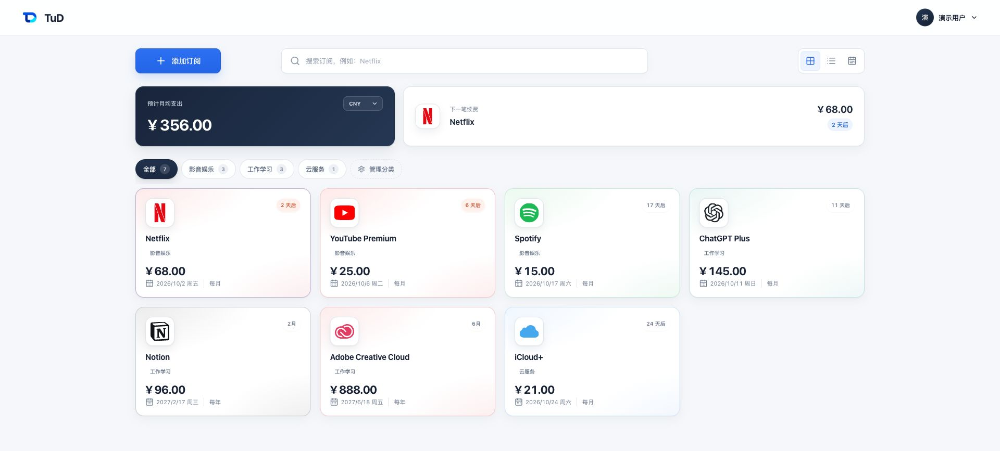
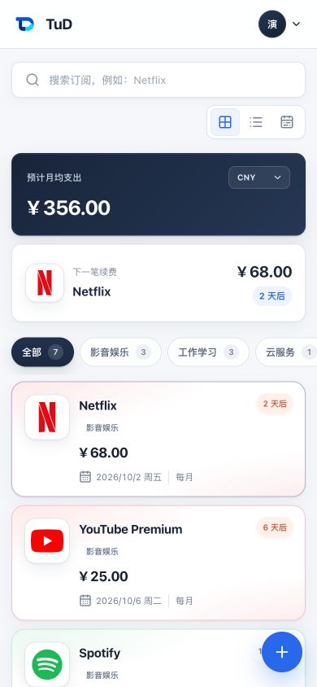
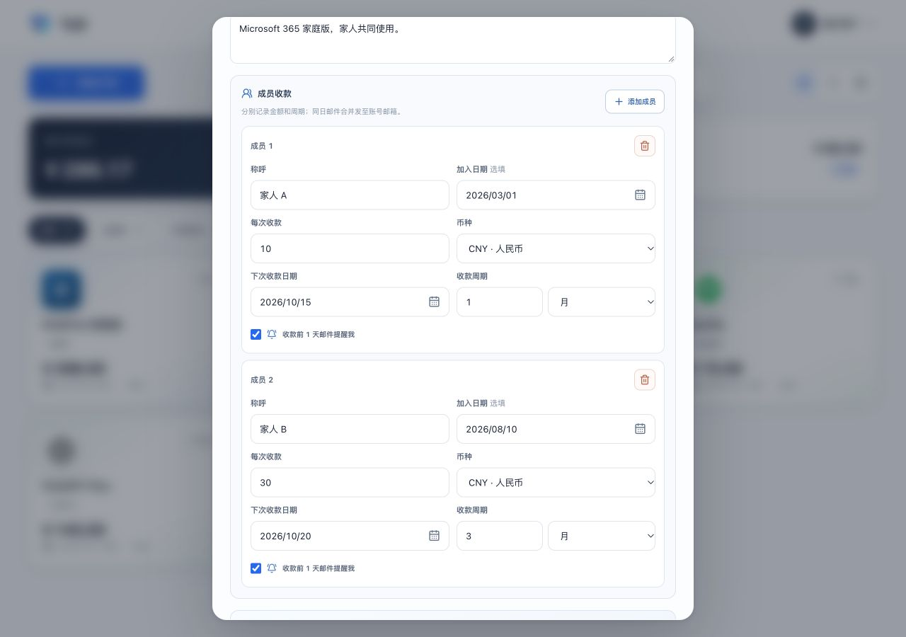
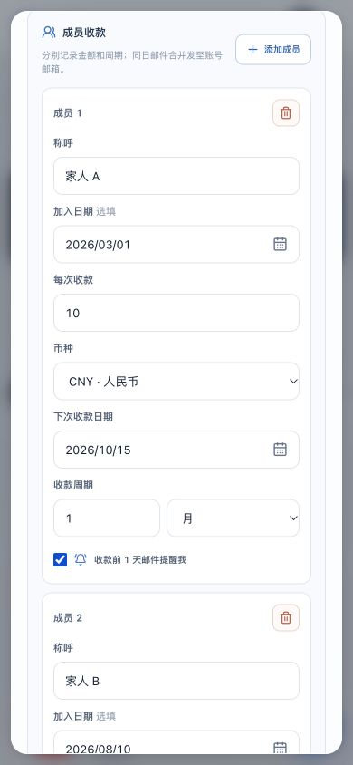
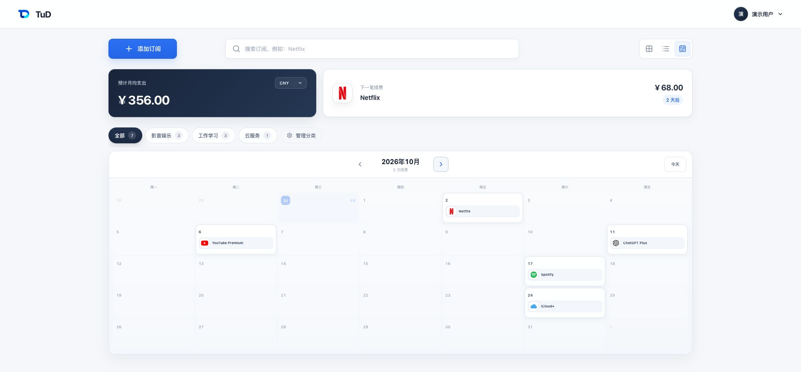
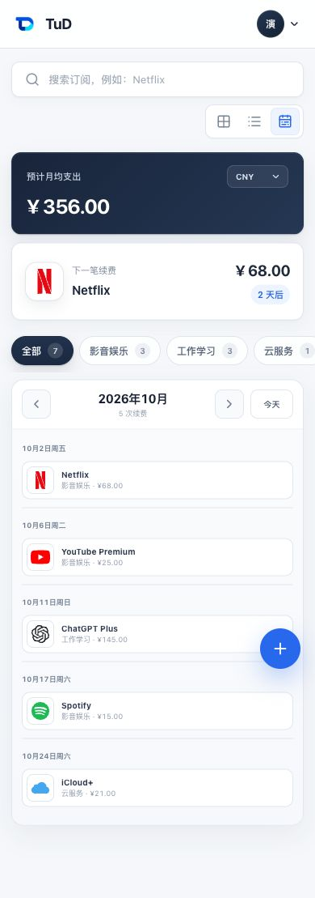

# TuD

TuD 是一套自托管的订阅管理系统，以订阅为中心记录费用、续费和可选的成员收款计划。分类、支出汇总、日历与提醒围绕同一份服务端数据工作，桌面和手机都能使用。

[产品结构](#1-产品结构) · [真实界面](#2-实际界面) · [本地运行](#3-本地运行) · [部署](#4-部署到自己的服务器) · [AI 连接](#5-ai-连接)

## 1. 产品结构

一项订阅是一条独立记录，包含服务、费用、币种、续费周期和下次续费日期。分类由用户自己创建，用来组织这些订阅；月均支出、即将到期的项目和日历则从订阅记录中汇总出来。币种覆盖人民币、美元、欧元、土耳其里拉、玻利维亚诺、菲律宾比索、新西兰元等。

成员收款安排属于某项订阅，但有自己的金额、币种、收款周期、下次收款日和历史记录。它用于记清谁在什么时候应付或已付，不会改变该订阅的支出，也不需要给成员创建登录账号。

网页和 API 由 TuD 服务提供，账号由 TuD 自己管理，不依赖 ChatGPT 登录；订阅及收款数据保存在 PostgreSQL 中。按用户设置，每日任务通过 SMTP 向管理者发送提醒；受信任的工具可通过可撤销的 AI Key 访问同一账号的数据。

## 2. 实际界面

下面的图片都截自当前 TuD 界面。账号、订阅和金额是专门准备的演示数据。

### 2.1 首页：先看下一笔什么时候扣费

首页列出订阅、下一笔续费和预计月均支出。可以按自己创建的分类筛选，切换网格、列表和日历；不同币种的支出也能汇总到选定货币。服务图标可以从目录搜索、从官网发现，找不到时还可以用字母图标。



**手机端首页**



### 2.2 成员收款：每个人有自己的日期和周期

在同一项订阅里，可以分别记录每位成员的加入时间、收款金额、币种、周期和下一次收款日。收到钱后，点一次“标记已收款”，历史会留下来，下次日期也会按该成员的周期推进。



**手机端成员收款**



每位成员都可以单独开启收款前一天的邮件提醒。邮件发给订阅管理者；同一订阅在同一天有多笔应收或续费时，会合并成一封。成员应收和订阅支出分别记录，不会自动抵扣。

### 2.3 日历：把续费落到具体日期

切到日历就能看到每项订阅在哪一天续费。手机上的日历会变成按日期排列的日程，方便往下看。



**手机端日程**



## 3. 本地运行

准备好 **Node.js 22.13.0 或更新版本**、npm 和 Docker，然后在仓库根目录执行：

```bash
cp .env.example .env
chmod 600 .env
npm ci
docker compose up -d --wait postgres
```

打开 `.env`，把 `BETTER_AUTH_SECRET` 换成自己生成的值（可运行 `openssl rand -base64 32`）。本地没有 SMTP 时，把示例里的 `SMTP_HOST`、`SMTP_USER`、`SMTP_PASSWORD` 留空，不要使用 `smtp.example.com`。接着运行：

```bash
npm run db:migrate
npm run dev
```

访问 <http://localhost:3000>，使用注册页支持的公共邮箱创建账号。开发环境未配置 SMTP 时，邮箱验证码会显示在终端；登录后可在“账户与安全”添加 Passkey。

## 4. 部署到自己的服务器

仓库提供生产 Compose：TuD 和 PostgreSQL 分开运行，应用监听服务器本机端口，由 Nginx 等反向代理提供 HTTPS。邮件提醒需要配置 SMTP，并安装每日执行的提醒任务。

从准备环境变量到首次上线、备份、更新和回滚，按 [服务器部署指南](docs/DEPLOYMENT.md) 操作。尤其要保存好数据库备份；回滚应用镜像不会撤销已经执行的数据库迁移。

## 5. AI 连接

在“AI 连接”页面创建 AI Key，可以让受信任的 AI 工具通过 HTTP 查看和管理你的订阅、分类、成员收款等数据。页面会给出连接说明；接口入口是 `/api/ai/v1`，OpenAPI 描述位于 `/api/ai/v1/openapi`。

AI Key 能修改数据，完整内容只在创建时显示一次。只把它交给你信任的工具；不再使用时可在页面撤销。每把 Key 只能访问创建它的账号的数据。

## 6. 数据、贡献与许可

TuD 自己管理账号，订阅和成员收款数据保存在自己的 PostgreSQL 中。浏览器本地存储不作为数据来源；生产环境需要 HTTPS、邮件服务和数据库备份。

想参与开发，请先看 [贡献指南](CONTRIBUTING.md)；提交改动前运行 `npm run test:release`。安全问题请按 [SECURITY.md](SECURITY.md) 私下报告。源码采用 [MIT License](LICENSE)，服务图标的来源、许可和商标说明见 [第三方资产说明](THIRD_PARTY_NOTICES.md)。
